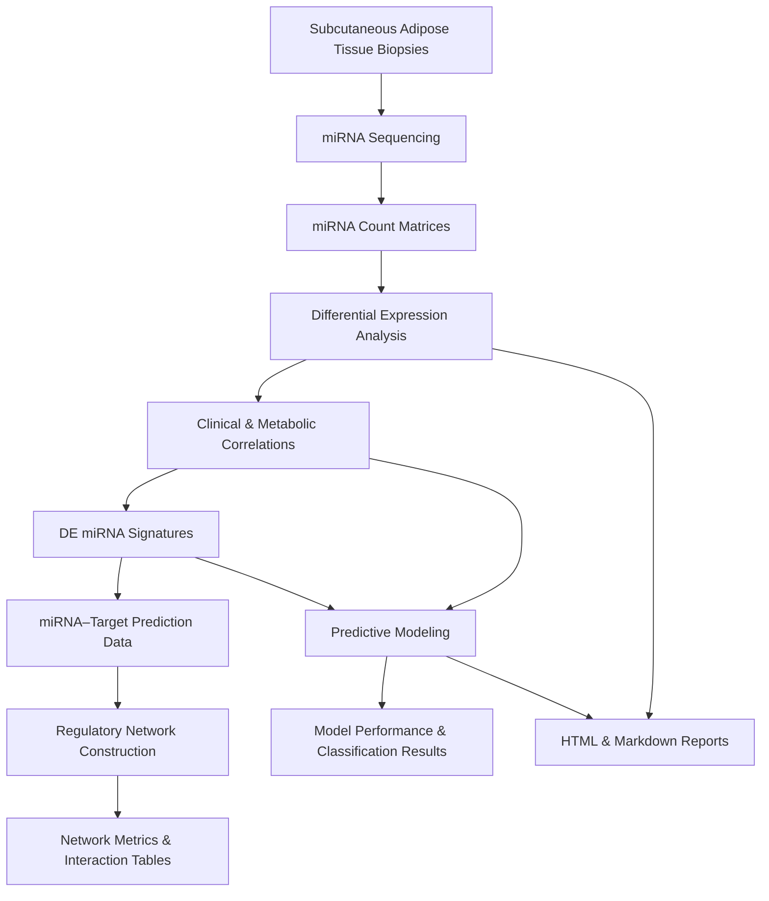

# Subcutaneous Adipose miRNome – Mexican Cohort

## Overview

This repository contains a comprehensive and reproducible computational workflow for the analysis of the subcutaneous adipose tissue miRNome in a Mexican adult cohort, with a particular focus on insulin sensitivity and insulin resistance. The study integrates miRNA differential expression profiling, clinical correlation analyses, regulatory network reconstruction, and predictive modeling to identify early molecular signatures associated with metabolic dysfunction.

By combining miRNA-seq data with anthropometric, metabolic, and inflammatory variables, this project adopts a systems biology perspective to explore miRNA-mediated regulatory mechanisms underlying insulin resistance.

---

## Study Design

Participants were stratified into two phenotypic groups based on insulin status:

- Insulin-sensitive individuals  
- Insulin-resistant individuals  

Insulin resistance was defined using the HOMA-IR index. Subcutaneous adipose tissue biopsies were obtained, followed by total RNA extraction and miRNA sequencing. Downstream analyses integrate molecular and clinical data to assess both mechanistic associations and predictive potential of miRNA expression profiles.


---

## Repository Structure and Analytical Workflow

The repository is organized according to the main analytical stages of the study. Each stage is structured with clearly defined input, script, and output directories to ensure transparency and reproducibility.

## Analytical Pipeline Overview
#


The complete analytical workflow implemented in this repository is summarized in the following pipeline diagram, illustrating data flow from raw miRNA expression matrices to systems-level network analysis and predictive modeling.

## Repository Content Index

```text
Subcutaneous-Adipose-miRNome-MexicanCohort/
│
├── INPUTS_DE-miRNAs/
│   └── miRNA count matrices and metadata used for
│       differential expression and clinical correlation analyses
│
├── INPUTSmiRNAs-targetsNetworks/
│   └── miRNA–target prediction datasets used for
│       regulatory network reconstruction
├── INPUTSML/
│   └── datasets used for
│       Machine learning predictive analysis
│
├── OUTPUTSmiRNA-targetNets/
│   └── Generated miRNA–target interaction networks,
│       tables, and network-level metrics
│
├── miRNA_analysis_pipeline.Rmd
│   └── R Markdown script for miRNA differential expression,
│       multivariate exploration, and clinical correlation analyses
│
├── miRNA_analysis_pipeline.html
│   └── Rendered HTML report of the miRNA analysis pipeline
│
├── miRNAs-targetNETs.py
│   └── Python script for miRNA–target regulatory
│       network construction and analysis
│
├── miRNA_IR_IS_LASSO_RF_Bootstrap_.Rmd
│   └── R Markdown scripts implementing supervised
│       predictive modeling approaches
│
├── miRNA_IR_IS_LASSO_RF_Bootstrap_.html
│   └── Rendered HTML reports for predictive modeling analyses
│
└── README.md
    └── Project description, analytical workflow,
        and reproducibility documentation
```

### 1. Differential Expression and Clinical Correlation Analysis

This stage identifies miRNAs differentially expressed between insulin-sensitive and insulin-resistant individuals and evaluates their associations with clinical, anthropometric, metabolic, and inflammatory variables.

**Scripts**
- `miRNA_analysis_pipeline.Rmd`
- `miRNA_analysis_pipeline.html`

These scripts implement normalization, differential expression analysis using DESeq2, exploratory multivariate analyses (including PCA), visualization (volcano plots and heatmaps), and correlation analyses with clinical traits.

**Inputs**
- `INPUTS_DE-miRNAs/`

This directory contains miRNA count matrices and metadata required for differential expression and clinical correlation analyses.

**Outputs**

All figures, tables, and summary statistics generated during this stage are stored in output directories associated with the corresponding scripts.

---

### 2. miRNA–Target Regulatory Network Analysis

This stage reconstructs miRNA–target interaction networks to explore the regulatory impact of differentially expressed miRNAs at the systems level.

**Script**
- `miRNAs-targetNETs.py`

This Python script integrates miRNA target prediction data to construct miRNA–gene regulatory networks and compute network-level features relevant to insulin resistance.

**Inputs**
- `INPUTSmiRNAs-targetsNetworks/`

This directory contains miRNA–target interaction datasets used for network reconstruction.

**Outputs**
- `OUTPUTSmiRNA-targetNets/`

This directory stores network files, interaction tables, and derived network metrics generated by the Python pipeline.

---

### 3. Predictive Modeling Analysis

The final stage evaluates the predictive capacity of miRNA expression profiles, alone or in combination with clinical variables, to discriminate between insulin-sensitive and insulin-resistant individuals.

**Scripts**
- Predictive modeling scripts written in R:
  - Markdown (`.Rmd`)
  - HTML (`.html`)

These scripts implement supervised machine learning models, cross-validation strategies, and performance evaluation metrics.

**Inputs**

All required input data are located in the corresponding `INPUTS` directories associated with the predictive modeling scripts.

**Outputs**

Model results, performance metrics, and visualizations are stored in output directories named according to each script.

---

## Computational Environment

All analyses were conducted using R and Python.

R-based analyses were performed using packages including DESeq2, ggplot2, gtsummary, caret, and related ecosystem tools.  
Python-based analyses were conducted using pandas, numpy, networkx, and matplotlib.

Rendered HTML reports are provided to ensure full transparency and facilitate interpretation of results without requiring code execution.

---

## Reproducibility

The clear separation of inputs, scripts, and outputs ensures that each analytical stage can be independently reproduced, audited, or extended. Scripts are provided in both executable and rendered formats to support reproducible research practices.

---

## Intended Use

This repository is intended for researchers interested in:

- miRNA regulation in metabolic and complex diseases  
- Insulin resistance and early metabolic dysfunction  
- Integrative analysis of transcriptomic and clinical data  
- Network biology and predictive modeling approaches  

---

## Author

**Katia Aviña Padilla, PhD**  
Computational Biology | Systems Omics | miRNA Regulation  
Mexican Cohort Studies in Metabolic Health

CINVESTAV
katia.avinap@cinvestav.mx 

---

## Citation

If you use this repository or its analytical framework, please cite it as:

Aviña Padilla, K. (2025). *Subcutaneous Adipose miRNome – Mexican Cohort*. GitHub repository.  
https://github.com/kap8416/Subcutaneous-Adipose-miRNome-MexicanCohort
